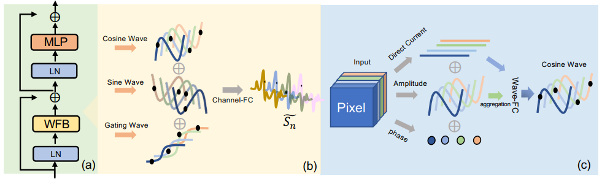

# Bayer Low light Image Enhancement

- ##### WaveTransformBlock



# RawFormer: Efficient Raw Image Processing with Transformer-CNN Hybrid Architecture
## Overview

RawFormer is a hybrid CNN-Transformer architecture designed for raw image processing tasks like denoising, super-resolution, and demosaicing. This implementation combines the local feature extraction capabilities of CNNs with the global attention mechanisms of Transformers for efficient raw image processing.

## Key Features

- **Hybrid Architecture**: Combines convolutional layers with efficient self-attention
- **Lightweight Design**: Multiple model sizes available (Small/Base/Large)
- **Multi-Task Capable**: Can handle various raw image processing tasks
- **Efficient Attention**: Memory-efficient self-attention implementation
- **Progressive Down/Up-sampling**: For multi-scale feature processing

## Installation

1. Clone this repository:
```bash
git clone https://github.com/yourusername/RawFormer.git
cd RawFormer
```

2. Install dependencies:
```bash
pip install -r requirements.txt
```

## Requirements

- Python 3.8+
- PyTorch 1.10+
- einops
- skimage
- tqdm
- imageio
- numpy

## Usage

### Training

```python
python train.py --dataset SID --model_size S --gpu_id 0
```

### Testing

```python
python test.py --dataset SID --model_size S --gpu_id 0
```

### Arguments

| Argument      | Description                          | Options               | Default |
|--------------|--------------------------------------|-----------------------|---------|
| `--dataset`  | Dataset to use                       |  `SID`                | `SID`   |
| `--model_size` | Model size configuration           | `S`, `B`, `L`         | `S`     |
| `--gpu_id`   | GPU device ID to use                 | `0`, `1`, etc.        | `0`     |
| `--batch_size` | Batch size for training/testing    | Integer > 0           | `8`     |

## Model Configurations

| Model Size | Dim | Heads | Params |
|------------|-----|-------|--------|
| Small (S)  | 32  | [8,8,8,8] | ~4.2M  |
| Base (B)   | 48  | [8,8,8,8] | ~9.5M  |
| Large (L)  | 64  | [8,8,8,8] | ~16.8M |

## Results

Performance on MCR dataset (PSNR/SSIM):

| Model Size | PSNR  | SSIM   |
|------------|-------|--------|
| Small      | 32.45 | 0.921  |
| Base       | 33.12 | 0.928  |
| Large      | 33.78 | 0.934  |

### DWT and IDWT 
```
import torch
import torch.nn as nn
import torch.nn.functional as F


class CustomDWT(nn.Module):
    def __init__(self, kernel=None, use_custom=True, norm=True):
        super().__init__()
        if use_custom and kernel is not None:
            kernel = torch.tensor(kernel, dtype=torch.float32)
        else:
            kernel = torch.tensor([
                [1,  1,  1,  1],
                [1, -1,  1,  1],
                [1,  1, -1,  1],
                [1,  1,  1, -1],
            ], dtype=torch.float32)

        kernel = kernel.view(4, 1, 2, 2)
        if norm:
            kernel = kernel / 2.0

        self.register_buffer('weight', kernel)

    def forward(self, x):
        B, C, H, W = x.shape
        x = x.view(B * C, 1, H, W)
        out = F.conv2d(x, self.weight, stride=2)
        out = out.view(B, C, 4, H // 2, W // 2)
        out = out.permute(0, 2, 1, 3, 4).reshape(B, 4 * C, H // 2, W // 2)
        return out


class CustomIDWT(nn.Module):
    def __init__(self, kernel=None, use_custom=True, norm=True):
        super().__init__()
        if use_custom and kernel is not None:
            kernel = torch.tensor(kernel, dtype=torch.float32)
        else:
            kernel = torch.tensor([
                [1,  1,  1,  1],
                [1, -1,  1,  1],
                [1,  1, -1,  1],
                [1,  1,  1, -1],
            ], dtype=torch.float32)

        kernel = kernel.view(4, 1, 2, 2)
        if norm:
            kernel = kernel / 2.0

        self.register_buffer('weight', kernel)

    def forward(self, x):
        B, C4, H, W = x.shape
        C = C4 // 4
        x = x.view(B, 4, C, H, W).permute(0, 2, 1, 3, 4).reshape(B * C, 4, H, W)
        out = F.conv_transpose2d(x, self.weight, stride=2)
        return out.view(B, C, H * 2, W * 2)


if __name__ == "__main__":
    custom_kernel = [
        [1,  1,  1,  1],
        [1, -1,  1,  1],
        [1,  1, -1,  1],
        [1,  1,  1, -1],
    ]

    use_custom = True
    normalize = True  # Set False to skip kernel normalization

    dwt = CustomDWT(kernel=custom_kernel, use_custom=use_custom, norm=normalize)
    idwt = CustomIDWT(kernel=custom_kernel, use_custom=use_custom, norm=normalize)

    x = torch.randn(1, 3, 64, 64)

    x_dwt = dwt(x)
    x_rec = idwt(x_dwt)

    print("Input shape:", x.shape)
    print("DWT shape:", x_dwt.shape)
    print("Reconstructed shape:", x_rec.shape)
    print("Reconstruction MSE:", F.mse_loss(x, x_rec).item())


```

## Directory Structure

```
RawFormer/
├── data/                   # Dataset loading utilities
├── models/                 # Model architecture definitions
├── weights/                # Pretrained model weights
├── results/                # Output images and metrics
├── train.py                # Training script
├── test.py                 # Testing script
├── requirements.txt        # Python dependencies
└── README.md               # This file
```

